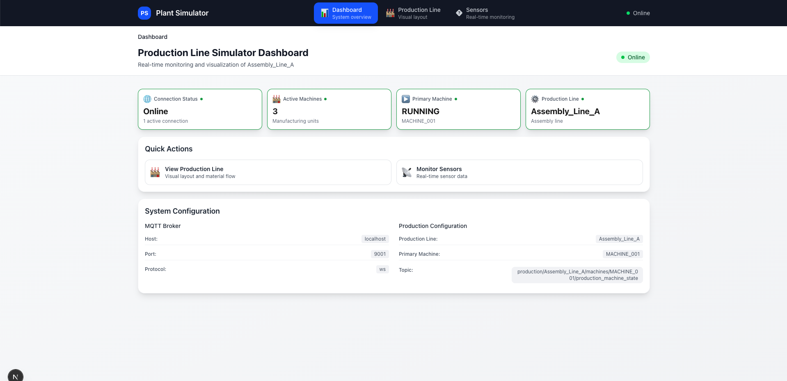
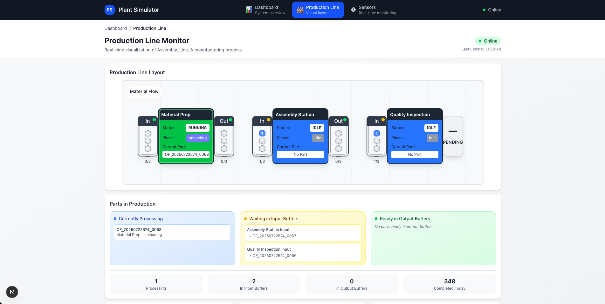
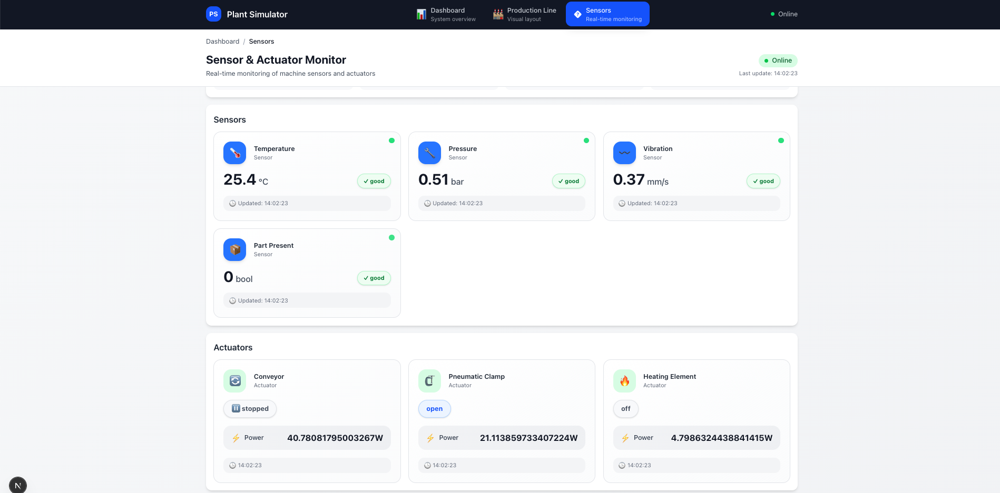
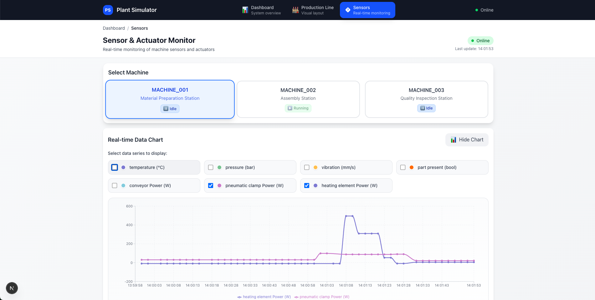
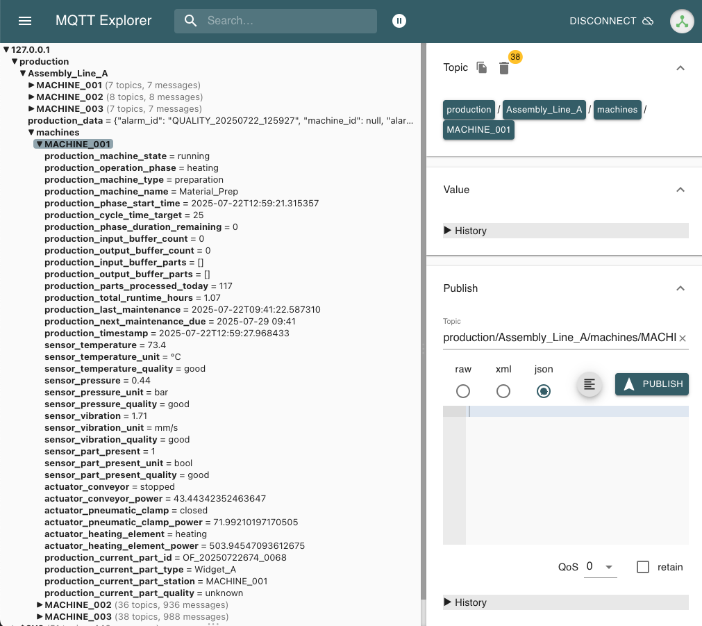

# Production Line Simulator
A comprehensive Python-based production line simulator that models industrial manufacturing processes with realistic sensor data, actuator control, MQTT communication, and **real-time web dashboard visualization**.

### Web Dashboard
- **Production Line Visualization**: Top-down view with machine status, phases, and current parts
- **Buffer Monitoring**: Real-time buffer utilization between machines
- **Sensor Dashboard**: Detailed sensor data with quality indicators for each machine
- **System Overview**: Connection status, machine count, and key metrics
- **Responsive Design**: Mobile-friendly interface with intuitive navigation


*Main dashboard showing system overview, connection status, and quick navigation*


## 🏗️ System Architecture

```
┌─────────────────────┐    ┌──────────────────┐    ┌─────────────────┐
│   Dashboard UI      │    │  MQTT Broker     │    │ Plant Simulator │
│   (Next.js React)   │◄──►│  (Mosquitto)     │◄──►│   (Python)      │
│   Port: 3000        │    │  Port: 1883/9001 │    │                 │
│ • Production Line   │    │ • WebSocket      │    │ • 3 Machines    │
│ • Sensor Monitor    │    │ • MQTT Topics    │    │ • Buffers       │
│ • Real-time Data    │    │ • Message Broker │    │ • Sensors       │
└─────────────────────┘    └──────────────────┘    └─────────────────┘
```

## 🎯 Features

### 🏭 Production Line Simulator
- **3-Machine Production Line**: Material Preparation → Assembly → Quality Inspection
- **Realistic Sensor Data**: Temperature, pressure, speed, quality metrics
- **Smart Actuator Control**: Conveyors, pumps, valves with feedback
- **Buffer Management**: Inter-machine inventory tracking
- **Quality Control**: Inspection with pass/fail decisions

### Web Dashboard
- **Production Line Visualization**: Top-down view with machine status, phases, and current parts
- **Buffer Monitoring**: Real-time buffer utilization between machines
- **Sensor Dashboard**: Detailed sensor data with quality indicators for each machine
- **System Overview**: Connection status, machine count, and key metrics
- **Responsive Design**: Mobile-friendly interface with intuitive navigation

## 🚀 Quick Start

### Using Docker Compose (Recommended)

```bash
# Start all services (MQTT broker + Plant simulator + Web UI)
docker-compose up --build

# Access the web dashboard
open http://localhost:3000
```

This will start:
- **MQTT Broker**: `localhost:1883` (TCP) / `localhost:9001` (WebSocket) 
- **Plant Simulator**: Publishing real-time production data
- **Web Dashboard**: `http://localhost:3000` with live visualization

### Manual Setup

```bash
# 1. Start MQTT Broker
cd simulator/docker && docker-compose up mqtt-broker -d

# 2. Start Plant Simulator  
cd ../.. && python simulator/main.py

# 3. Start Web UI
cd UI && npm install && npm run dev
```

## Dashboard Pages

### 1. Overview (`/`)
- System connection status
- Active machine count
- Primary machine state
- Quick navigation links

### 2. Production Line (`/production-line`)
- **Top-down factory layout** with 3 machines positioned horizontally
- **Machine status display**: State, phase, current part production
- **Buffer visualization**: Part count and capacity between machines
- **Conveyor animation**: Material flow representation


*Production line visualization showing machine layout, buffers, and real-time status*

### 3. Sensor Monitor (`/sensors`)
- **Machine selection dropdown** for detailed monitoring
- **Real-time sensor data**: Temperature, pressure, speed with units
- **Actuator status**: Conveyor, pump, valve states and power consumption
- **Quality indicators**: Visual good/poor/bad status for all sensors


*Sensor and actuator monitoring with real-time data cards*


*Real-time data visualization with interactive chart selection*

## 📖 Documentation

**[Complete Production Simulator Guide](simulator/docs/PRODUCTION_SIMULATOR_GUIDE.md)** - Everything you need:

- **Manufacturing Process**: Complete 3-station production line overview
- **MQTT Integration**: Data publishing, topic structure, and formats  
- **Machine Operations**: States, phases, and sensor/actuator details
- **Quality Control**: Inspection process and quality metrics
- **Quick Start**: Docker and local development setup
- **Configuration & Troubleshooting**: Setup and common issues

**[UI Dashboard Guide](UI/README.md)** - Web interface details:

- **Component Architecture**: React components and design patterns
- **MQTT Integration**: WebSocket connection and data flow
- **Visual States**: Machine status colors and indicators
- **Configuration**: Environment variables and customization
- **Troubleshooting**: Common issues and debug commands

**Additional Resources:**
- **[Deployment Guide](simulator/docs/DEPLOYMENT.md)** - Production deployment instructions

## 🏭 Manufacturing Simulation Features

- **Realistic Machine Simulation**: Individual machine models with sensors, actuators, and state management
- **Production Line Orchestration**: Manages multiple machines in a manufacturing flow
- **MQTT Integration**: Real-time data publishing for industrial IoT systems
- **Quality Control**: Inspection stations with pass/fail quality checks
- **Malfunction Simulation**: Realistic equipment failures and recovery scenarios
- **Performance Metrics**: OEE, throughput, quality rates, and cycle time tracking
- **Docker Support**: Containerized deployment with MQTT broker
- **Comprehensive Testing**: Full test suite for all components

## 🎯 MQTT Data Streams


*Real-time MQTT data publishing and subscription architecture*

### Machine Status (All Machines)
```bash
# Current processing state
production/Assembly_Line_A/machines/MACHINE_001/production_machine_state          # "idle", "running", "malfunction"
production/Assembly_Line_A/machines/MACHINE_001/production_current_part_id        # "OF_20250721001_0001" or "(null)"

# Production metrics  
production/Assembly_Line_A/machines/MACHINE_001/production_parts_processed_today  # "12"
production/Assembly_Line_A/machines/MACHINE_001/production_cycle_time_target      # "25"
```

### Sensor Data (Real-time, 1-2 Hz)
```bash
production/Assembly_Line_A/machines/MACHINE_001/sensor_temperature         # "85.2" (°C)
production/Assembly_Line_A/machines/MACHINE_002/sensor_force               # "120.5" (N)
production/Assembly_Line_A/machines/MACHINE_003/sensor_camera              # "1920" (pixels)
```

### Actuator Data (Event-driven)
```bash
production/Assembly_Line_A/machines/MACHINE_001/actuator_conveyor          # "running", "stopped"
production/Assembly_Line_A/machines/MACHINE_002/actuator_robot_arm         # "assembling", "home"
production/Assembly_Line_A/machines/MACHINE_003/actuator_reject_pusher     # "retracted", "extended"
```

## 🧪 System Validation

The system includes comprehensive testing:
- **62/62 Tests Passing**: Complete test coverage
- **Performance**: 87,000+ sensor readings/second capability
- **MQTT Validation**: All machines publish comprehensive data
- **Docker Integration**: Containerized deployment tested

## 🔧 Development

### Simulator Development
```bash
cd simulator/
python3 -m venv venv
source venv/bin/activate
pip install -r requirements.txt
python main.py
```

### UI Development
```bash
cd UI/
# UI-specific setup instructions will be added here
```

## 🏭 Manufacturing Simulation

### Machine Types

1. **Material Preparation Station** (MACHINE_001)
   - Sensors: Temperature, Pressure, Vibration, Part Present
   - Actuators: Conveyor, Pneumatic Clamp, Heating Element
   - Cycle Time: 25 seconds

2. **Assembly Station** (MACHINE_002)
   - Sensors: Force, Position, Torque, Part Present
   - Actuators: Robot Arm, Screwdriver, Conveyor
   - Cycle Time: 35 seconds

3. **Quality Inspection Station** (MACHINE_003)
   - Sensors: Camera, Laser Measurement, Weight, Part Present
   - Actuators: Conveyor, Reject Pusher, Sorting Gate
   - Cycle Time: 20 seconds

### Production Flow

```
Raw Material → Preparation → Assembly → Inspection → Finished Product
                    ↓            ↓           ↓
                 Buffer       Buffer    Quality Gate
                                           ↓
                                    Rejected Parts
```

## 📡 MQTT Data Streams

The simulator publishes comprehensive real-time data via MQTT:

### Topic Structure
```
production/{line_name}/machines/{machine_id}/{data_category}_{data_point}
```

### Example Topics
```bash
# Machine state data
production/Assembly_Line_A/machines/MACHINE_001/production_machine_state
production/Assembly_Line_A/machines/MACHINE_001/production_current_part_id

# Sensor data with metadata
production/Assembly_Line_A/machines/MACHINE_001/sensor_temperature
production/Assembly_Line_A/machines/MACHINE_001/sensor_temperature_unit
production/Assembly_Line_A/machines/MACHINE_001/sensor_temperature_quality

# Actuator control with power consumption
production/Assembly_Line_A/machines/MACHINE_001/actuator_conveyor
production/Assembly_Line_A/machines/MACHINE_001/actuator_conveyor_power
```

## ⚙️ Configuration

### Environment Variables
```bash
# MQTT Configuration
MQTT_BROKER_HOST=localhost
MQTT_BROKER_PORT=1883
MQTT_USERNAME=user
MQTT_PASSWORD=password

# Simulation Settings
SIMULATION_SPEED=1.0          # Real-time multiplier
LOG_LEVEL=INFO                # Logging level
PRODUCTION_LINE_NAME=Assembly_Line_A
```

### Machine Configuration
Machines are configured in `src/config/settings.py` with:
- Cycle times
- Failure rates
- Sensor types
- Actuator types
- Quality thresholds

## 🔧 Development

### Adding New Machine Types
1. Extend the `Machine` class in `src/models/machine.py`
2. Define sensors and actuators in configuration
3. Implement specific operation logic
4. Add MQTT topic mappings

### Extending MQTT Topics
1. Modify `publish_machine_status()` in `src/core/mqtt_client.py`
2. Update topic structure in documentation
3. Add corresponding test cases

### Custom Quality Control
1. Implement logic in `_perform_quality_check()` method
2. Define quality thresholds in configuration
3. Add quality metrics to reporting


## 📄 License

This project is licensed under the MIT License - see the LICENSE file for details.

## 🎯 Use Cases

### Industrial Automation
- HMI development and testing
- SCADA system integration
- PLC communication simulation
- IoT data analytics

### Education and Training
- Manufacturing process understanding
- Industrial automation concepts
- MQTT protocol learning
- Production optimization techniques

### System Development
- Industrial software testing
- Data integration validation
- Performance monitoring systems
- Quality control systems

---

**Production Line Simulator** - Bringing industrial manufacturing simulation to your development environment.
